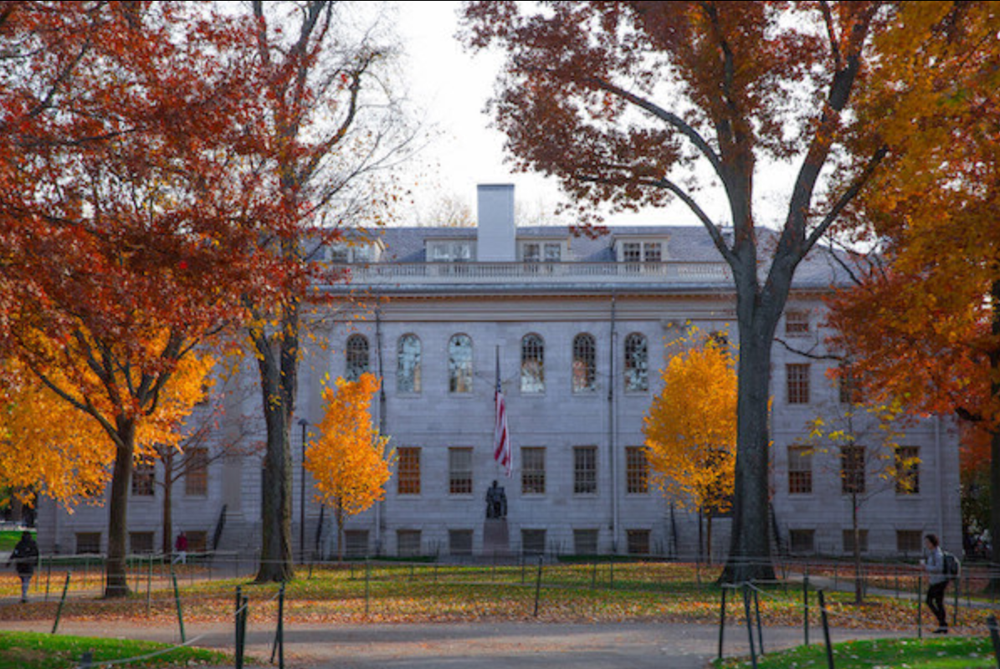
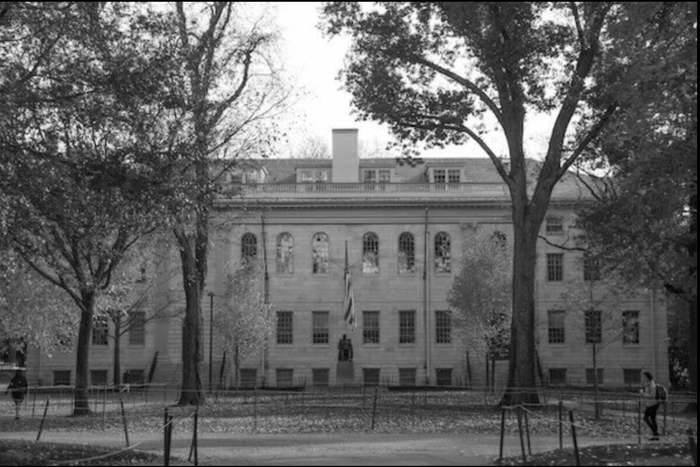
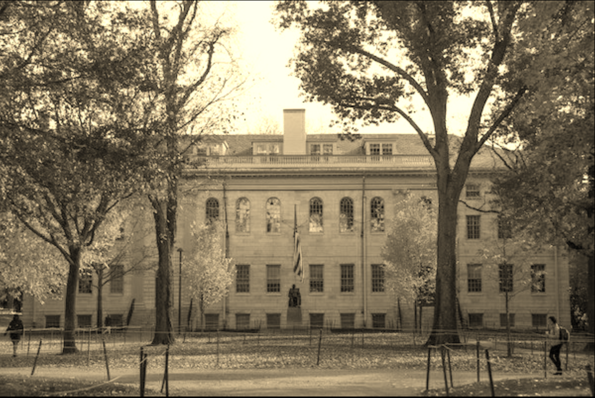
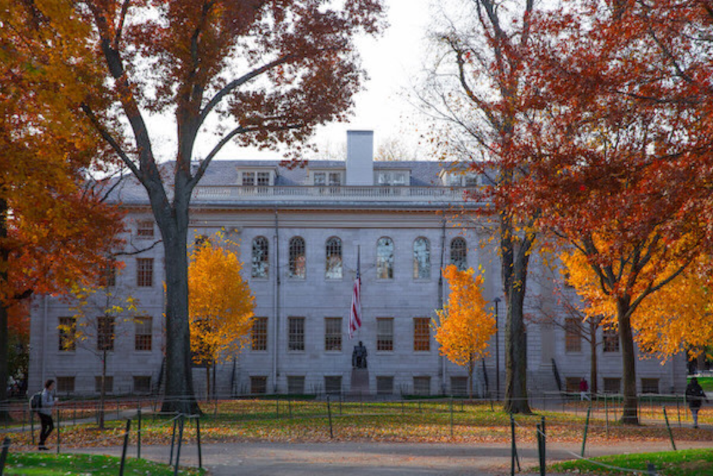
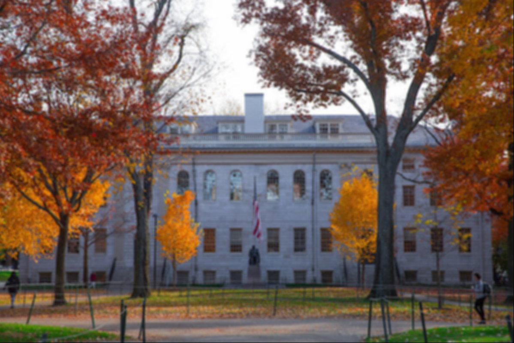

# Image Filter

## Overview
This project is a C-based image processing program that applies various visual filters to 24-bit BMP images.
It demonstrates how images can be manipulated at the pixel level using structs, arrays, and file I/O in C.
Each filter modifies the RGB values of every pixel to produce different visual effects such as grayscale, sepia, reflection, and blur.

---
## Features
- ** Original Image**
  - Original image of the yard


- **Grayscale**
  - Converts image to black-and-white by averaging RGB values


- **Sepia**
  - Applies a warm, vintage-style tone to the image


- **Reflection**
  - Flips the image horizontally


- **Blur**
  - Softens the image using a box blur algorithm


---
## Technologies Used

- C Programming Language  
- CS50 Library  
- BMP File Format  
- Structs and 2D Arrays  
- File I/O (reading and writing images)  
- Makefile for compilation  

---

## How to Run

### 1. Compile the program
```bash
make filter
```
2. Run a filter
```
./filter -g images/yard.bmp output.bmp
```
Replace -g with:

-g → grayscale
-s → sepia
-r → reflection
-b → blur
	
## What I Learned
How images are represented as pixel data (RGB values)
How BMP files store metadata and pixel arrays
How to manipulate 2D arrays efficiently in C
The importance of copying data when modifying images
Debugging edge cases in nested loops and array bounds

## Why This Project Matters
This project demonstrates foundational computer science concepts used in real-world graphics and image processing systems, including:

- Pixel-level data manipulation
- Memory-aware programming in C
- Algorithmic thinking for transformations
- Working with file formats and binary data

## About Me
This project is part of my computer science portfolio.

I’m currently exploring:
- Software development
- Algorithms and data structures
- Web development
- Systems programming

## Contact
Email: taran.ubbi@gmail.com
GitHub: https://github.com/TaranUbbi
